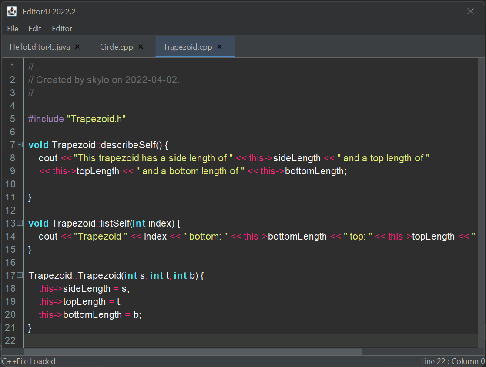

This is the Editor4J 2022.2+ source repository, please don't
use the old repository.

Editor4J is a WIP RSyntaxTextArea-based Lightweight Code-Editor
written in pure Java with syntax highlighting support for:

- Java
- C/C++
- Kotlin
- HTML/CSS/JavaScript
- Python
- Ruby

And more!

