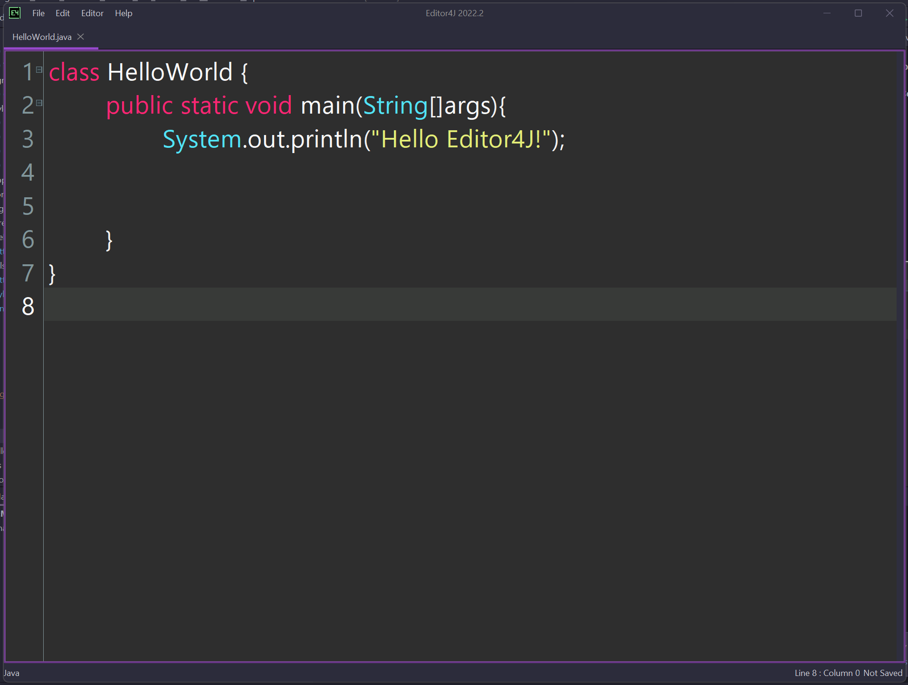

# Editor4J 2022.4

Editor4J is for anyone looking for a lightweight code-editor for teaching coding
in schools or learning individually. Professional IDEs like IntelliJ, Eclipse and NetBeans are great
but their features can sometimes make the experience more complicated, and you end up
spending time learning to use the IDE instead of Learning to code.

Editor4J *will* also add support for creating and taking courses uploaded by the community
or on a private server.

Check out our (new!) Trello board for an update on development!
https://trello.com/b/Tw6ABlzG/editor4j-making-coding-accessible

You can also file an issue in GitHub if you find a bug, please give:

* Clear Reproduction steps (I pressed this, then that)
* What you expected
* What happened instead
* Environment information OS, JDK (visible in Help > About), directory listing of /appdata folder

**Pro Tip**: You can usually get a stacktrace of what happened from Editor > Error Log

Editor4J is under the MIT License visible in *resources/LICENSE* or viewable in About > License

